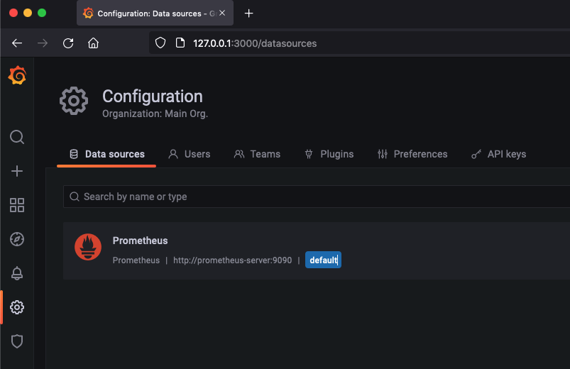
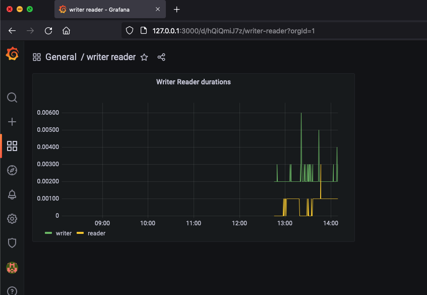

## Install application in minikube

 Install minikube and start it

    minikube start

(to get docker image from local rep need this) Enable the container environment inside minikube with docker-env to use it on your local computer.

    minikube docker-env

(to get docker image from local rep need this) Execute the given command.

    eval $(minikube docker-env)

 
build image writerdockerise
    
    cd wirter
    docker build -t writerdockerise .

build image readerdockerise

    cd reader 
    docker build -t readerdockerise .

in new terminal

start configmap

    kubectl create -f configmap-mariadb-master.yml
    kubectl create -f configmap-prometheus.yml
    
    kubectl create -f configmap-mariadb-master.yml && kubectl create -f configmap-prometheus.yml

start services

    kubectl create -f service-mariadb.yml
    kubectl create -f service-mariadb-slave.yml
    kubectl create -f service-reader.yml
    kubectl create -f service-prometheus.yml 
    kubectl create -f service-grafana.yml 
    kubectl create -f service-pushgateway.yml

    kubectl create -f service-mariadb.yml && kubectl create -f service-mariadb-slave.yml && kubectl create -f service-reader.yml && kubectl create -f service-prometheus.yml && kubectl create -f service-grafana.yml && kubectl create -f service-grafana.yml && kubectl create -f service-pushgateway.yml

start deployments

    kubectl create -f deploy-mariadb-master.yml
    kubectl create -f deploy-mariadb-slave.yml
    kubectl create -f deploy-writer.yml
    kubectl create -f deploy-reader.yml
    kubectl create -f deploy-prometheus.yml
    kubectl create -f deploy-grafana.yml 
    kubectl create -f deploy-pushgateway.yml 

    kubectl create -f deploy-mariadb-master.yml && kubectl create -f deploy-mariadb-slave.yml && kubectl create -f deploy-writer.yml && kubectl create -f deploy-reader.yml && kubectl create -f deploy-prometheus.yml && kubectl create -f deploy-grafana.yml && kubectl create -f deploy-pushgateway.yml

Open ports to outside enable forward server each in separate terminal tab:

    kubectl port-forward service/mariadb-master 3306:3306
    kubectl port-forward service/mariadb-slave 3307:3306
    kubectl port-forward service/reader-server 4444:4444
    kubectl port-forward service/prometheus-server 9090:9090
    kubectl port-forward service/grafana-server 3000:3000

Configure grafana (manual step):

connect prometheus
in browser: 

    http://127.0.0.1:3000

connect prometheus to grafa:
configuration->datasource add Prometheus

create two dashboards writer and reader:

add plus sign -> browse -> add dashboard:
add two queries and add Metric browser:
with avg(writer) and avg(reader)
save graph and dashboard

## Test application:

test reader.

Open new terminal and run:

    echo | nc 127.0.0.1 4444

get result(like):

    count(*) 3155 reader-server-6f89f4dbf-8kpxm

check master and slave mysql

check pod names with command

    kubectl get pods

after that in separate terminal(pod name just as example):

    kubectl exec -ti mariadb-master-55c7c9f49b-vnw2q bash

after that in separate terminal(pod name just as example):

    kubectl exec -ti mariadb-slave-55c7c9f49b-vnw2q bash

check for master and for slave:

    mysql -h 127.0.0.1 -u root -pmasterqwerty -D test -e  "SELECT count(*) FROM test.new_table; "

## END of instruction.
## Below are some additional commands for debug:

6a. delete:

    kubectl delete -f configmap-mariadb-master.yml
    kubectl delete -f configmap-prometheus.yml 

delete deployments

    kubectl delete -f deploy-mariadb-master.yml
    kubectl delete -f deploy-mariadb-slave.yml
    kubectl delete -f deploy-writer.yml
    kubectl delete -f deploy-reader.yml
    kubectl delete -f deploy-prometheus.yml 
    kubectl delete -f deploy-grafana.yml 
    kubectl delete -f deploy-pushgateway.yml 

delete services

    kubectl delete -f service-mariadb.yml
    kubectl delete -f service-mariadb-slave.yml
    kubectl delete -f service-reader.yml
    kubectl delete -f service-prometheus.yml 

get logs:

    kubectl logs podname